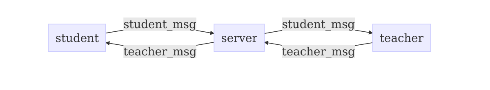
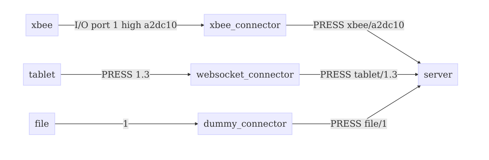
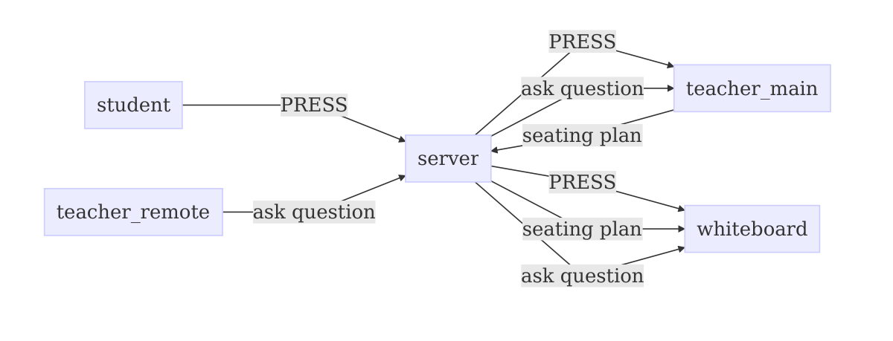

| Component | Build | Coverage |
|-----------|-------|----------|
| Server |  |  |
| Student App |  |  |
| Teacher App |  |  |
| Teacher App |  |  |

# Clickr
An audience Response Systen for schools.
Clickr aims to be cheap to deploy and easy to set up.

## Architecture
Clickr consists of:
- one [server](https://github.com/ftes/clickr-server)
- multiple clients
  - teacher clients
    - [teacher](https://github.com/ftes/clickr-teacher) web app
    - [whiteboard](https://github.com/ftes/clickr-whiteboard) web app
  - [student](https://github.com/ftes/clickr-student) hybrid web app (cordova)
  - to come: _teacher remote_ client

### Basic Architecture

### Student Devices

### Teacher Devices

